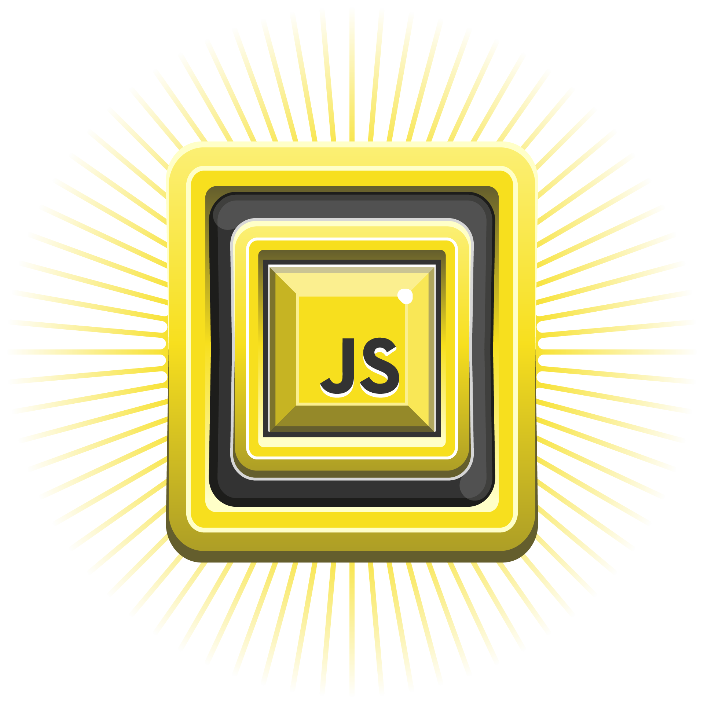

  
  
[DIO - Digital Innovation One](https://web.dio.me)  

# Base Camp JavaScript Project: To-Do List 
- Instructor JavaScript: Stephany Nusch 
  

  
## [Project Deploy](https://github.com/malanski/toDoList/)
 
### TQI Fullstack Developer
- Bootcamp at Digital Innovation One  

#### Objectives
  
1 Create a text input field and a button that add Tasks to de list  
2 As the button is pressesd the text should render on the list aside a checkbox  
3 When the user selects the checkbox, the corresponding item must have the text crossed out. (eg task complete. tip: you can easily solve this with CSS)  
    

